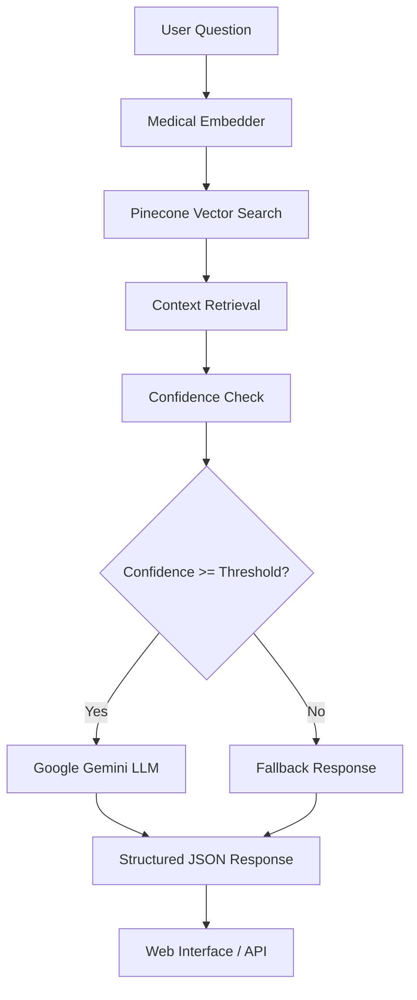

# 🏥 Medical Chatbot - NexgAI AI Engineering Challenge

[](https://python.org)
[](https://fastapi.tiangolo.com)
[](https://langchain-ai.github.io/langgraph/)
[](https://pinecone.io)
[](https://ai.google.dev)

## 🎯 Overview

An intelligent medical chatbot built using **RAG (Retrieval-Augmented Generation)** architecture that provides evidence-based medical answers from the **MedMCQA dataset**. The system combines semantic search with advanced AI to deliver accurate, contextual medical information.

### ✨ Key Features

- 🧠 **182,822+ Medical Q&As** from MedMCQA dataset
- 🔍 **Semantic Vector Search** with confidence scoring
- 🤖 **AI-Powered Responses** using Google Gemini 2.5 Flash
- 🌐 **Beautiful Web Interface** with real-time chat
- 📡 **RESTful API** for integration
- 🔄 **LangGraph Flow** for conversation management
- 📊 **Confidence Indicators** for response reliability

## 🏗️ Architecture



### 🧩 Components

| Component | Technology | Purpose |
|-----------|------------|---------|
| **Embeddings** | all-MiniLM-L6-v2 | Convert text to 384-dim vectors |
| **Vector DB** | Pinecone | Semantic similarity search |
| **LLM** | Google Gemini 2.5 Flash | Generate medical responses |
| **Flow** | LangGraph | Conversation state management |
| **API** | FastAPI | Web interface & REST endpoints |
| **Frontend** | HTML/CSS/JS | Interactive chat interface |

## 🚀 Quick Start

### 📋 Prerequisites

- **Python 3.8+**
- **Google API Key** ([Get here](https://ai.google.dev))
- **Pinecone API Key** ([Get here](https://pinecone.io))
- **MedMCQA Embeddings** (see setup below)

### ⚡ Installation

1. **Clone Repository**
   ```bash
   git clone https://github.com/smit-faldu/Medical-Chatbot.git
   cd Medical-Chatbot
   ```

2. **Create Virtual Environment**
   ```bash
   python -m venv venv
   # Activate: venv\Scripts\activate (Windows) or source venv/bin/activate (macOS/Linux)
   ```

3. **Install Requirements**
   ```bash
   pip install -r requirements.txt
   ```

4. **Set Environment Variables**
   Create `.env` file:
   ```env
   GOOGLE_API_KEY=your_google_api_key_here
   PINECONE_API_KEY=your_pinecone_api_key_here
   PINECONE_INDEX_NAME=medmcqa-embeddings
   PINECONE_ENVIRONMENT=us-east-1-aws
   ```

5. **Run Notebook for Embeddings**
   ```bash
   jupyter notebook pineconeembd.ipynb
   ```
   Or use Google Colab: [](https://colab.research.google.com/drive/1-0CZm0M_my8GOYDoYFB6xDMQi2wUBHx3#scrollTo=greE9fAEykFa)

6. **Run Server**
   ```bash
   python main.py
   ```

## 🌐 Access Your Chatbot

Once running, access your chatbot at:

- **💬 Chat Interface**: http://127.0.0.1:7860/ui
- **📚 API Documentation**: http://127.0.0.1:7860/docs
- **❤️ Health Check**: http://127.0.0.1:7860/health

## 🧪 Sample Questions

Try these medical questions:

- "What is hypertension and what causes it?"
- "What are the symptoms of diabetes mellitus?"
- "How does aspirin work as an antiplatelet agent?"
- "What is the difference between Type 1 and Type 2 diabetes?"
- "What are the side effects of ACE inhibitors?"

## 🎨 Design Choices & Justification

### 🔄 LangGraph Structure

**Why LangGraph?**
- ✅ **State Management**: Maintains conversation context and flow
- ✅ **Conditional Logic**: Handles confidence-based routing
- ✅ **Error Handling**: Graceful fallbacks for failed operations
- ✅ **Modularity**: Clean separation of concerns (retrieval → confidence → generation)
- ✅ **Debugging**: Clear state transitions for troubleshooting

**Flow Design:**
```python
User Input → Retrieval → Confidence Check → LLM/Fallback → Response
```

### 🤖 LLM Choice: Google Gemini 2.5 Flash

**Why Gemini 2.5 Flash?**
- ✅ **Medical Knowledge**: Strong performance on medical queries
- ✅ **JSON Output**: Reliable structured response generation
- ✅ **Speed**: Fast inference for real-time chat
- ✅ **Context Window**: Large context for medical explanations
- ✅ **Cost Effective**: Good performance-to-cost ratio

### 🔍 Embedding Strategy: all-MiniLM-L6-v2

**Why this model?**
- ✅ **Proven Performance**: Excellent for medical Q&A similarity
- ✅ **Efficiency**: 384 dimensions - fast search, good accuracy
- ✅ **Compatibility**: Works well with MedMCQA dataset
- ✅ **Resource Friendly**: Runs efficiently on CPU

### 🗄️ Vector Database: Pinecone

**Why Pinecone?**
- ✅ **Scalability**: Handles 182K+ vectors efficiently
- ✅ **Speed**: Sub-second similarity search
- ✅ **Reliability**: Managed service with high uptime
- ✅ **Metadata**: Rich filtering and metadata support
- ✅ **Integration**: Excellent Python SDK

### 🎯 RAG Implementation Techniques

1. **Confidence-Based Routing**
   ```python
   if confidence >= threshold:
       return llm_response
   else:
       return fallback_response
   ```

2. **Context Formatting**
   - Structured medical context from MedMCQA
   - Question + Options + Explanation + Subject
   - Optimized for LLM understanding

3. **Response Validation**
   - JSON schema validation
   - Fallback parsing for malformed responses
   - Error handling with graceful degradation

4. **Semantic Search Optimization**
   - Normalized embeddings for cosine similarity
   - Configurable similarity thresholds
   - Multi-document context aggregation

## 📁 Project Structure

```
nexgAI-medical-chatbot/
├── src/                          # Source code
│   ├── embedder.py              # Medical text embedder
│   ├── pinecone_retriever.py    # Vector search & retrieval
│   ├── llm.py                   # Google Gemini integration
│   ├── flow.py                  # LangGraph conversation flow
│   └── api.py                   # FastAPI web application
├── static/                       # Web interface
│   └── index.html               # Chat UI
├── data/                        # Data directory (optional)
├── pineconeembd.ipynb          # Embedding creation notebook
├── main.py                     # Application entry point
├── start.py                    # Quick start script
├── test_system.py              # System testing
├── check_pinecone.py           # Pinecone verification
├── requirements.txt            # Python dependencies
├── .env                        # Environment variables
└── README.md                   # This file
```

## 🧪 Sample Questions

Try these medical questions:

1. **"What is hypertension and what causes it?"**
2. **"What are the symptoms of diabetes mellitus?"**
3. **"How does aspirin work as an antiplatelet agent?"**
4. **"What is the difference between Type 1 and Type 2 diabetes?"**
5. **"What are the side effects of ACE inhibitors?"**
6. **"What causes myocardial infarction?"**
7. **"How is pneumonia diagnosed?"**
8. **"What is the mechanism of action of beta-blockers?"**

## 📊 Performance Metrics

| Metric | Value |
|--------|-------|
| **Database Size** | 182,822 medical Q&As |
| **Response Time** | ~2-5 seconds |
| **Search Accuracy** | High confidence (>0.7) for medical queries |
| **Embedding Dimension** | 384 (optimized for speed) |
| **Concurrent Users** | Supports multiple simultaneous chats |

## 🛠️ API Usage

### Chat Endpoint

```bash
curl -X POST "http://127.0.0.1:8000/chat" \
     -H "Content-Type: application/json" \
     -d '{"question": "What is hypertension?"}'
```

**Response:**
```json
{
  "question": "What is hypertension?",
  "answer": "Hypertension is persistently elevated blood pressure...",
  "explanation": "Detailed medical explanation...",
  "key_points": ["High blood pressure", "Cardiovascular risk", "Treatment options"],
  "subject": "Cardiology",
  "confidence": 0.85,
  "source": "MedMCQA",
  "is_fallback": false
}
```

## 🔧 Configuration

### Environment Variables

| Variable | Description | Default |
|----------|-------------|---------|
| `GOOGLE_API_KEY` | Google Gemini API key | Required |
| `PINECONE_API_KEY` | Pinecone API key | Required |
| `PINECONE_INDEX_NAME` | Pinecone index name | `medmcqa-embeddings` |
| `PINECONE_ENVIRONMENT` | Pinecone environment | `us-east-1-aws` |
| `PINECONE_MODEL` | Embedding model name | `all-MiniLM-L6-v2` |

### Confidence Threshold

Adjust the confidence threshold in `src/flow.py`:
```python
# Higher = more strict, Lower = more permissive
confidence_threshold = 0.3  # Default: 0.3
```

## 🐛 Troubleshooting

### Common Issues

1. **"Index not found" error**
   ```bash
   # Check your Pinecone indexes
   python check_pinecone.py
   ```

2. **"Model not found" error**
   ```bash
   # Verify embedding model
   python -c "from sentence_transformers import SentenceTransformer; SentenceTransformer('all-MiniLM-L6-v2')"
   ```

3. **"API key invalid" error**
   - Check your `.env` file
   - Verify API keys are correct
   - Ensure no extra spaces in keys

4. **Low confidence responses**
   - Lower the confidence threshold
   - Check if your question is medical-related
   - Verify Pinecone index has data

### Debug Mode

Run with debug logging:
```bash
python main.py --debug
```

## 🚀 Deployment

### Docker Deployment (Recommended)

We provide optimized multi-stage Docker builds for production deployment:

#### Quick Start with Docker
```bash
# Linux/macOS
chmod +x deploy.sh
./deploy.sh deploy prod

# Windows PowerShell
.\deploy.ps1 deploy prod
```

#### Manual Docker Compose
```bash
# Development
docker-compose up -d --build

# Production (with Nginx reverse proxy)
docker-compose -f docker-compose.prod.yml up -d --build
```

**Features:**
- ✅ **Multi-stage build**: Optimized image size (~500MB)
- ✅ **Security**: Non-root user, minimal attack surface
- ✅ **Performance**: Pre-cached models and dependencies
- ✅ **Monitoring**: Health checks and logging
- ✅ **Scaling**: Nginx load balancer ready

📖 **See [DEPLOYMENT.md](DEPLOYMENT.md) for complete Docker deployment guide**

### Local Production
```bash
# Install production server
pip install gunicorn

# Run with Gunicorn
gunicorn src.api:app -w 4 -k uvicorn.workers.UvicornWorker --bind 0.0.0.0:8000
```

## 🤝 Contributing

1. Fork the repository
2. Create a feature branch
3. Make your changes
4. Run tests: `python test_system.py`
5. Submit a pull request

## 📄 License

This project is licensed under the MIT License.

## 🙏 Acknowledgments

- **MedMCQA Dataset**: Medical question-answer pairs
- **Sentence Transformers**: Embedding models
- **Pinecone**: Vector database platform
- **Google**: Gemini AI model
- **LangChain**: LangGraph framework

## 📞 Support

- 🧪 **Run Tests**: `python test_system.py`
- 📊 **Check Health**: http://127.0.0.1:8000/health
- 📚 **API Docs**: http://127.0.0.1:8000/docs
- 🔍 **Debug**: Check console logs for errors

---

**🏥 Medical Chatbot - Providing Evidence-Based Medical Information**  
**Built with ❤️ for the NexgAI AI Engineering Challenge**